<div align="center">

# DRISHTI
### Disaster Risk Identification System for Hyperlocal Threat Intelligence

**Ward-level flash flood and geohazard early warning for India's hill districts.**
Fuses satellite rainfall, soil moisture, river level, slope tilt and glacier-melt signals into one risk score per ward, then decides how to alert based on how confident it is.

[](https://drishti-sih-liart.vercel.app/)
[](https://bit.ly/3VhVq5B)
[](https://bit.ly/4AvufEE)

**SIH 2026 · PS ID SIH26192 · Disaster Management · Team ThunderBolts! (Team ID 159702)**


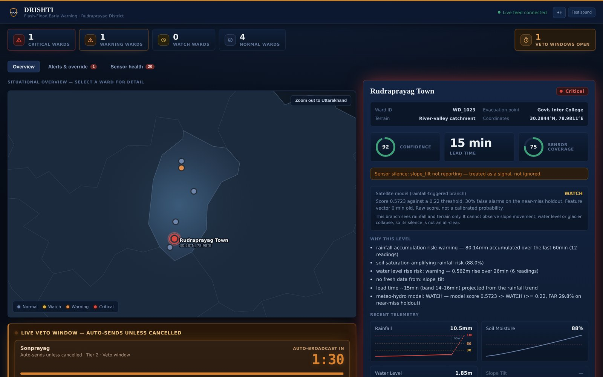

<sub>The authority dashboard during a two-ward escalation. Rudraprayag Town is Critical at 92% confidence (both branches agree), so it has already been dispatched. Sonprayag is at Warning with a Tier 2 veto countdown running.</sub>

</div>

---

## At a glance

| | |
|---|---|
| 🎯 **Problem** | Himalayan flash floods give minutes of warning, and existing systems stop at basin-level guidance on a forecaster's desk. |
| 💡 **What DRISHTI adds** | **Ward-level** risk, a **projected lead time**, and the **nearest evacuation point**, pushed out as a tiered alert. |
| ⛰️ **Differentiator** | A **geohazard branch** (slope tilt, glacier-melt temperature, water level) that catches floods **not caused by rain**, such as Chamoli 2021 and the 2023 Sikkim GLOF. Rainfall-only systems (FFGS, Google Flood Hub, NWS-FLASH) cannot see these by design. |
| ⏱️ **Alerting principle** | **Inaction still warns people.** Medium-confidence alerts auto-send after a countdown unless a human cancels them. |
| 🧠 **Model** | XGBoost on 34 satellite and reanalysis features (GPM IMERG, ERA5, SRTM, HydroSHEDS). Leave-one-storm-out CV, **PR-AUC 0.93**. |
| 🏗️ **Built** | FastAPI pipeline (ingest → risk → fusion → tiered dispatch), trained and deployed model, live dashboard, 25 regression tests. |

---

## See it working

<div align="center">
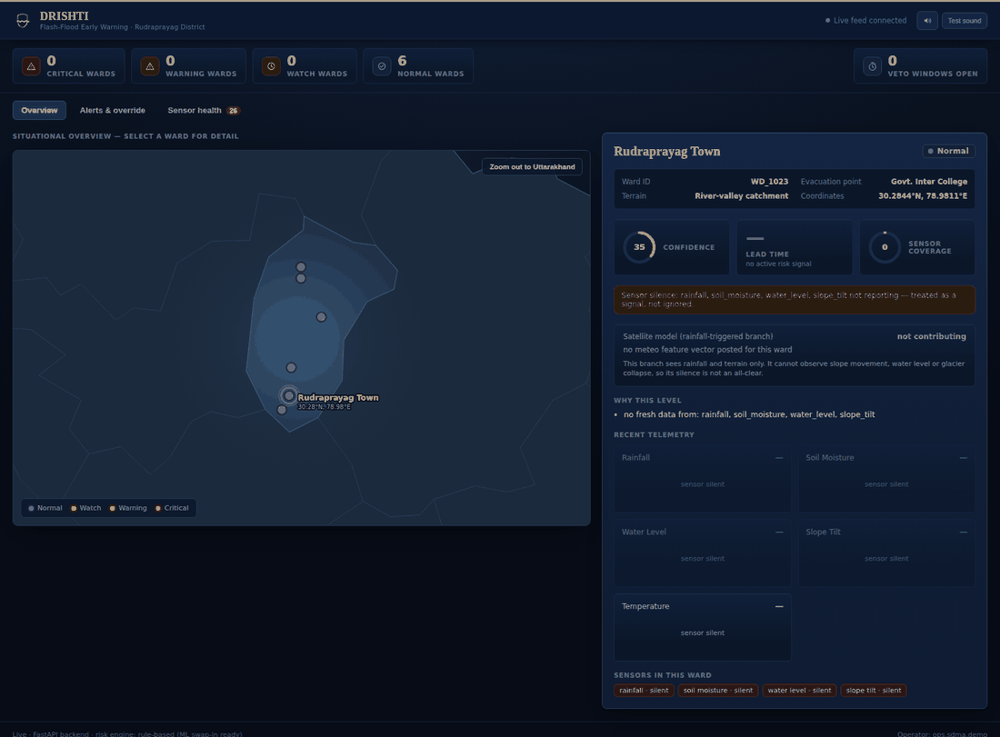

<sub><b>Rainfall storm → Critical → 90 s veto window → operator cancels with a logged reason.</b> The telemetry is scripted, but it runs through the same ingestion, risk and alert path that real sensor data would take.</sub>
</div>

### Scenario 1 — Rainfall storm: Tier 2 veto and a projected lead time

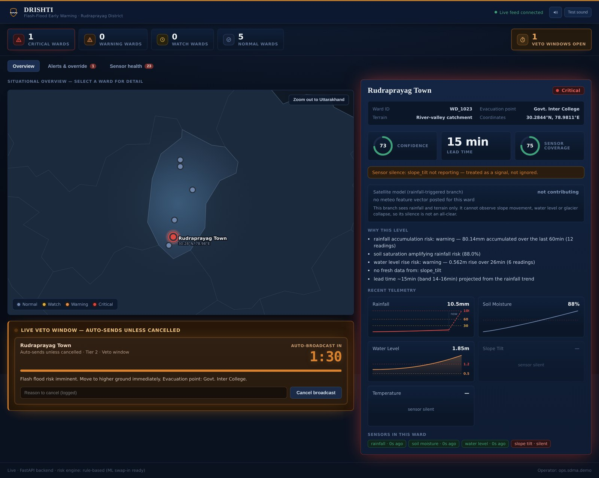

- Rainfall of **80 mm in 60 min** crosses the threshold, and **88% soil saturation amplifies** the risk. The river rises 0.56 m in 26 min.
- **Lead time ≈ 15 min (band 14–16)** is a least-squares projection of when accumulation crosses the critical line, not a fixed number.
- At **73% confidence** the alert lands in **Tier 2**. It **auto-broadcasts in 1:30** unless an operator cancels it.
- A slope-tilt sensor that has gone quiet is flagged as a signal, not ignored.

### Scenario 2 — Geohazard precursor: the event rainfall models miss

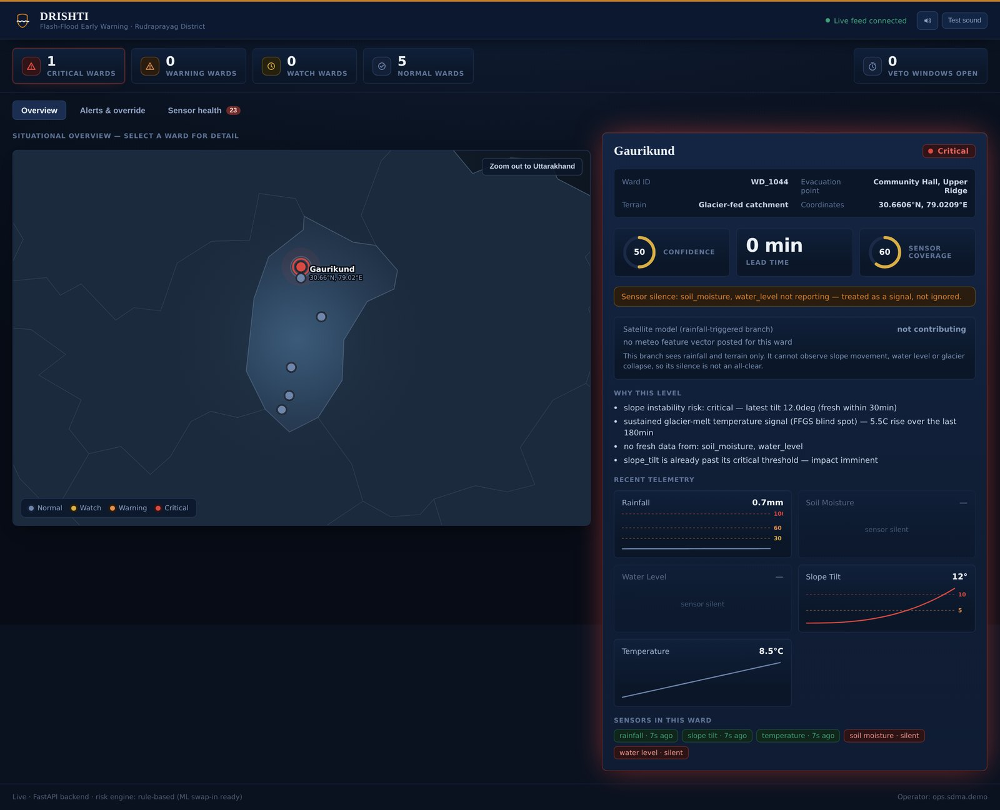

- **Gaurikund** is glacier-fed. There is **near-zero rain (0.7 mm)**, yet the ward is **Critical**.
- **Slope tilt has accelerated to 12°**, past the critical angle, and melt temperature has risen **5.5 °C over 3 h**.
- The driver is already past threshold, so the lead time reads **"impact imminent"** and the alert fires **immediately** with no veto window.
- The satellite rainfall branch **cannot observe this at all**. DRISHTI does not treat its silence as an all-clear, which is the gap behind Chamoli, Sikkim and Trishuli-class events.

### Scenario 3 — Two wards at once: both branches agree and the alert fires automatically

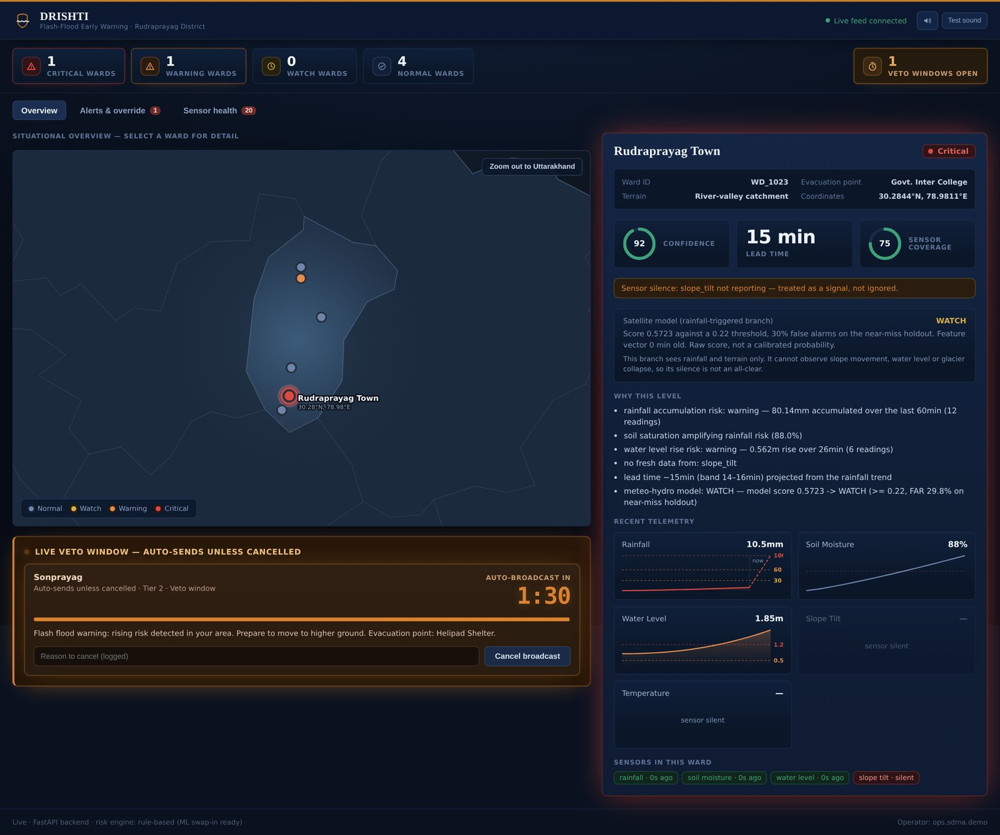

- In Rudraprayag Town, the **ground sensors and the satellite ML model agree** (model score 0.57 → WATCH). Combined confidence rises from **0.73 to 0.92**, which is **Tier 1**, so the alert is **dispatched instantly**. Corroboration bought back the veto window's minutes.
- Sonprayag reaches **Warning** in parallel and gets its own Tier 2 countdown.

<table>
<tr>
<td width="60%">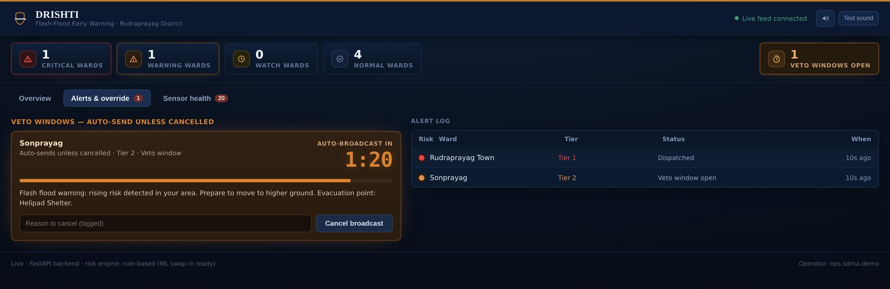</td>
<td width="40%">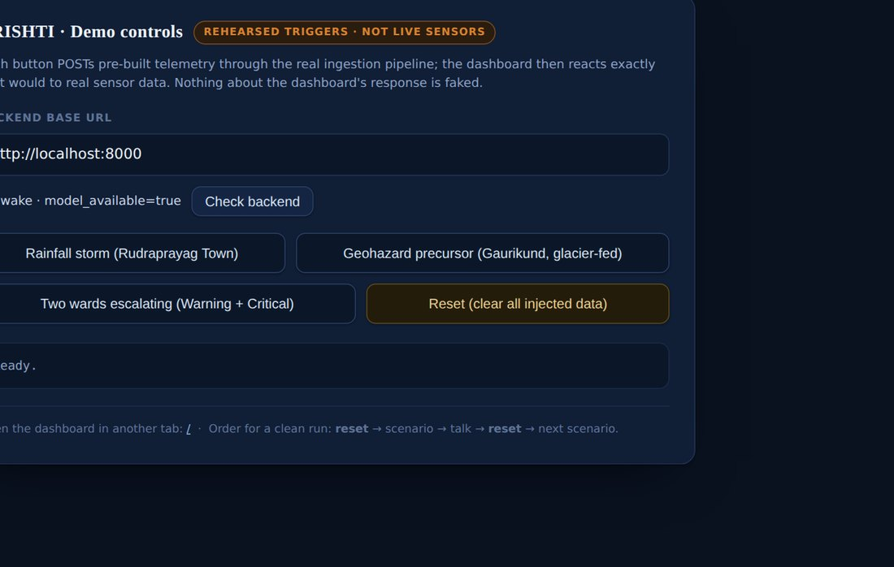</td>
</tr>
<tr>
<td><sub><b>Alerts & override:</b> an audit log of every alert with its tier, status and time. Veto windows sit on the left.</sub></td>
<td><sub><b>Demo controls</b> (<code>/demo-controls.html</code>): rehearsed triggers, clearly labelled as not live sensors.</sub></td>
</tr>
</table>

> **Try it:** open the [live demo](https://drishti-sih-liart.vercel.app/). With no backend configured, it runs a built-in simulator that includes a Tier 2 countdown you can veto.

---

## How it works

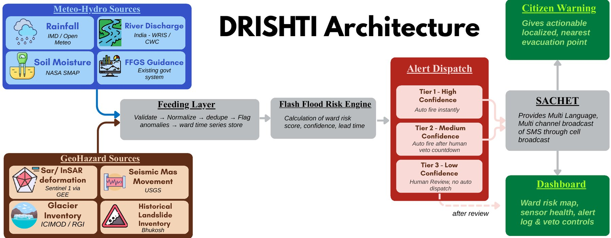

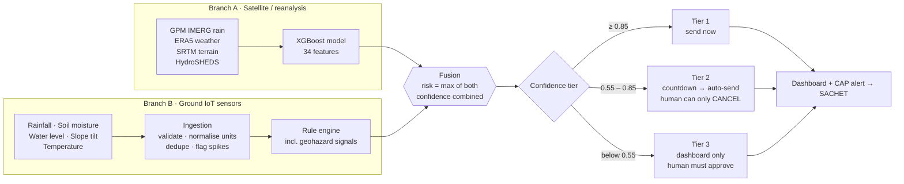

**Why two branches instead of one model?** The ML model sees 34 satellite features. The ground sensors produce 5 readings. There is no honest mapping between the two, so DRISHTI fuses their **verdicts**, not their inputs:

| Situation | Confidence | Why |
|---|---|---|
| Both branches elevated | Combined as independent evidence (cap 0.95) | Corroboration can promote an alert to Tier 1 |
| Satellite model only | −0.10 | A satellite-only call **never** fires fully automatically |
| Ground only, but the model had fresh data and disagreed | −0.10 | Fresh satellite data that sees nothing counts as evidence against |
| Ground only, driven by slope, water level or melt | **No penalty** | The rainfall model cannot see these, so its silence is not evidence. This rule is pinned by a test. |

**Safety rules in the dispatcher**
- A **Critical** assessment never sits in Tier 3. It is bumped to Tier 2, so someone has to actively kill it.
- The veto window is `min(90 s, 20% of lead time)`. If that comes out under 30 s, the window is skipped and the alert fires immediately, so the countdown never eats the lead time it exists to protect.
- A veto that arrives too late returns "already sent" instead of an error, so the operator is not misled.

<details>
<summary><b>Full system design (module-level)</b></summary>
<br>
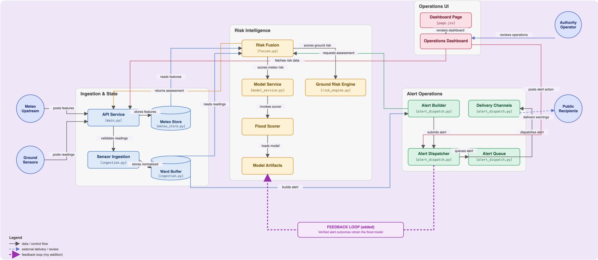
</details>

---

## Model results

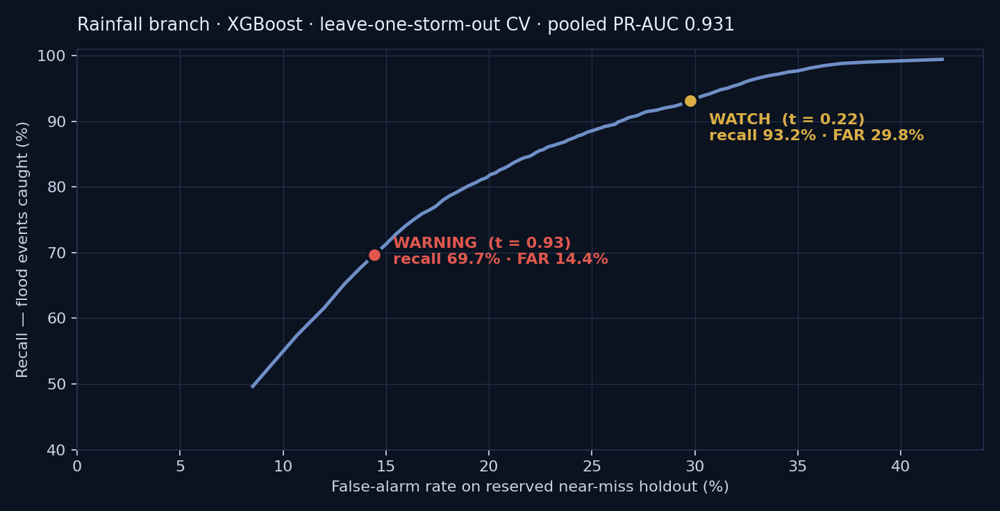

| Tier | Threshold | Recall | Precision | False-alarm rate* |
|---|---:|---:|---:|---:|
| **WARNING** | 0.93 | 69.7% | 92.1% | 14.4% |
| **WATCH** | 0.22 | 93.2% | 87.0% | 29.8% |

Pooled **PR-AUC 0.931**, against a flood base rate near 0.05%.
<sub>*False-alarm rate is measured on a **permanently reserved near-miss holdout**: the heaviest-rain days that did **not** flood, which are the hardest realistic negatives. Validation is leave-one-storm-out CV across 9 storm groups from 2019–2022 in Uttarakhand.</sub>

**Why two thresholds:** a single cut-off would give no signal at all for about 30% of real events. WATCH and WARNING mirror the US NWS Flash Flood Watch/Warning pattern. Numbers are read live from [`final_model_results.json`](drishti/ml/artifacts/final_model_results.json) and exposed at `GET /model/info`, so what runs is what is reported.

---

## How DRISHTI compares

| Capability | FFGS (India) | Google Flood Hub | US NWS-FLASH | **DRISHTI** |
|---|:---:|:---:|:---:|:---:|
| Rainfall-triggered floods | ✅ | ✅ | ✅ | ✅ |
| Validated on historical events | ✅ | ✅ | ✅ | ✅ |
| ML-driven risk scoring | ❌ | ✅ | ❌ | ✅ |
| High-resolution input | ❌ | ❌ | ✅ | ✅ |
| **Non-rainfall geohazards** (slope, glacier, GLOF) | ❌ | ❌ | ❌ | ✅ |
| **Ward-level alert + SACHET dispatch** | ❌ | ❌ | ❌ | ✅ |

DRISHTI **extends FFGS rather than replacing it**. FFGS guidance is one of its inputs, and alerts are rendered as CAP 1.2 messages for India's SACHET cell-broadcast network, which reaches basic phones without internet.

---

## What's built vs. designed

We state our scope up front so it doesn't come as a surprise.

| Component | Status |
|---|---|
| Rainfall ML model (XGBoost, 34 features) | ✅ Trained and served by the API |
| Ground-sensor rule engine (5 signals, incl. geohazard) | ✅ Working |
| Fusion, confidence scoring, lead-time projection | ✅ Working |
| Tiered dispatch, veto countdowns, retries, audit log | ✅ Working (channels log instead of sending SMS) |
| Authority dashboard (map, ward detail, sensor health, alerts) | ✅ Deployed on Vercel |
| CAP 1.2 alert export (`/alerts/{id}/cap`) | ✅ Working |
| Geohazard **ML** model (InSAR, seismic, glacier inventory) | 🟡 Designed; the rule branch covers it today |
| SACHET live integration, LoRaWAN sensor mesh | 🟡 Designed |

Known limitations, including in-memory state, no authentication on veto yet, coarse slope data, and why confidence is population-level, are listed in full in the **[engineering README](drishti/README.md#known-limitations)**.

---

## Run it locally

```bash
# Backend: FastAPI, model loads automatically
cd drishti/backend
pip install -r requirements.txt
python demo_end_to_end.py                  # six scenarios end-to-end, no server
python tests/test_pipeline_regressions.py  # 25 regression tests
uvicorn main:app --port 8000

# Frontend: Next.js dashboard
cd drishti/frontend
npm install
NEXT_PUBLIC_API_BASE=http://localhost:8000 npm run dev   # omit the variable for simulator mode
```

Then open `http://localhost:3000/demo-controls.html` and trigger a scenario. Deployment (Render for the backend, Vercel for the frontend) is covered in [`docs/DEPLOYMENT.md`](drishti/docs/DEPLOYMENT.md).

<details>
<summary><b>API surface</b></summary>

```
POST /ingest                      ground sensor readings
POST /wards/{id}/meteo            satellite feature vector for a ward
GET  /wards                       all wards with current risk
GET  /wards/{id}/risk             full assessment: both branches, lead time, tier
GET  /dashboard/sensor-health     per-sensor reporting / silent / missing
GET  /model/info                  loaded model, operating points, caveats
GET  /alerts/active | /history    alert queue and audit log
GET  /alerts/{id}/cap             CAP 1.2 XML for SACHET
POST /alerts/{id}/veto|approve|dismiss
WS   /ws/alerts                   live alert lifecycle events
```
</details>

---

## Repository map

```
drishti/
├── backend/    FastAPI: ingestion, rule engine, model service, fusion, alert dispatch, demo scenarios, tests
├── frontend/   Next.js authority dashboard + /demo-controls.html
├── ml/         Training script, two-tier scorer, trained booster, CV results
├── docs/       Project briefing, deployment guide, model feature contract
├── DEMO_SCRIPT.md   3–4 minute judge walkthrough
└── README.md        Full engineering reference (every file, every design decision)
```

---

## Grounding

**Case studies:** Chamoli (Feb 2021), Sikkim GLOF (Oct 2023), Himachal (Jul 2023), Trishuli glacier collapse, Nepal (2026), Blatten, Switzerland (2025).
**Policy alignment:** NDMA National Disaster Management Plan 2019 · National GLOF Risk Mitigation Programme · SACHET / CAP.
**Data:** GPM IMERG · ERA5 · SRTM · HydroSHEDS / HydroRIVERS · NASA SMAP · Sentinel-1 InSAR (via GEE) · USGS seismic · ICIMOD / RGI glacier inventory · Bhukosh landslide inventory.

<div align="center">
<sub>Built by <b>ThunderBolts!</b> for Smart India Hackathon 2026</sub>
</div>
